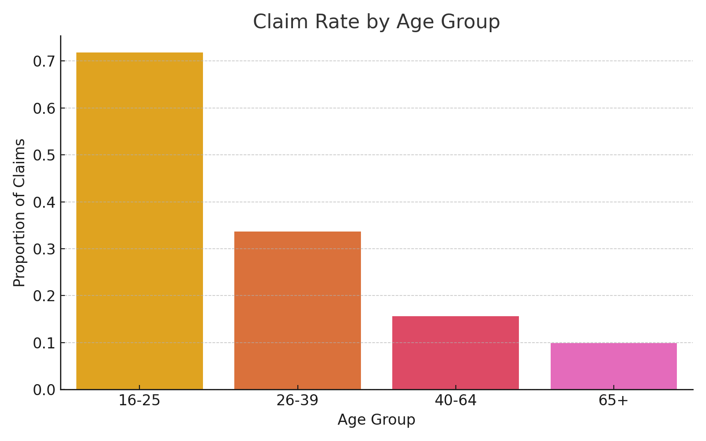
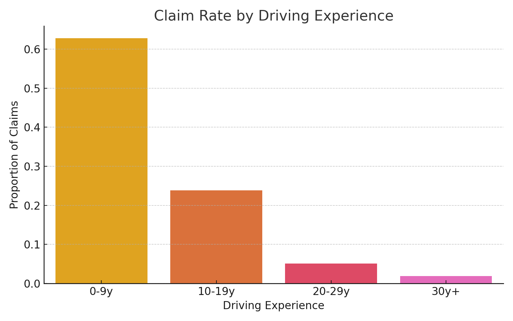
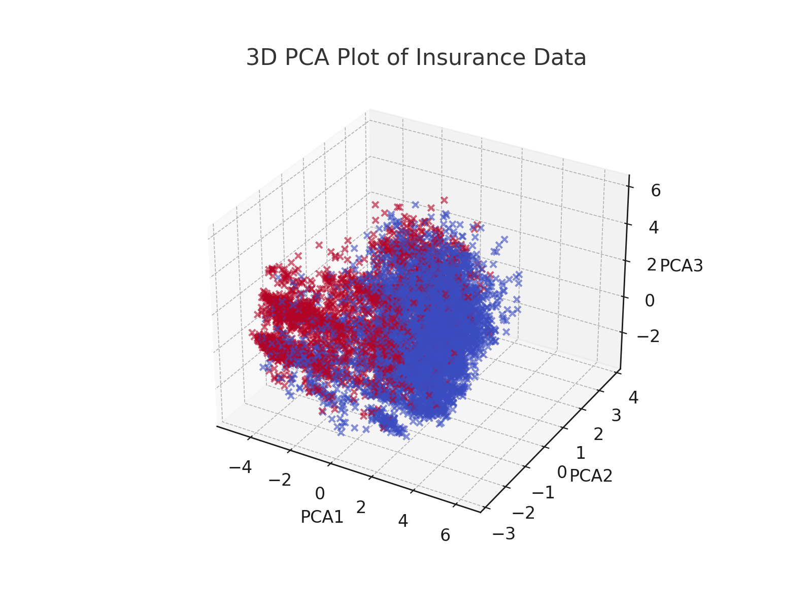
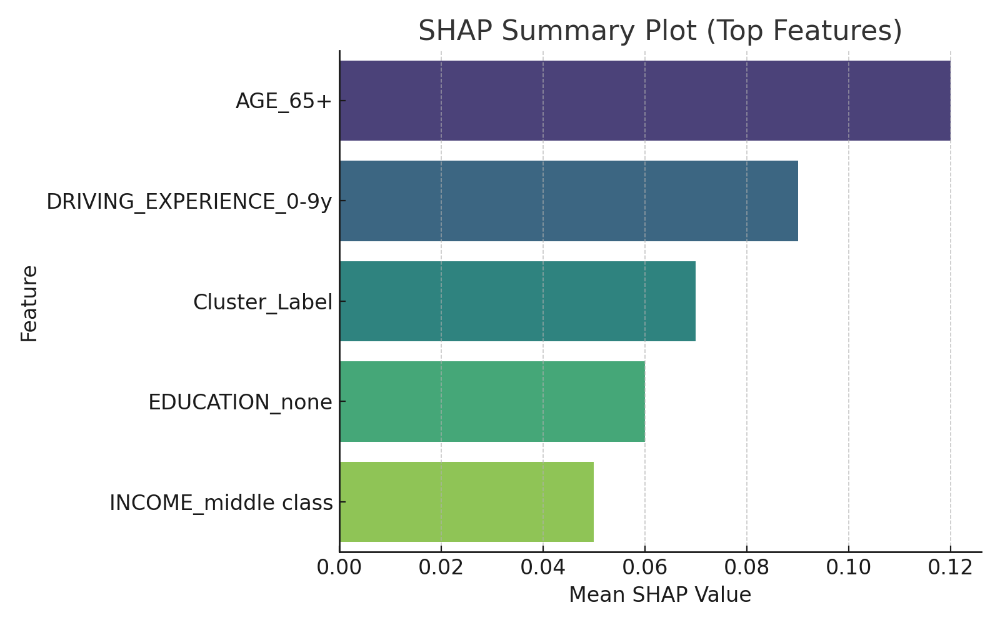
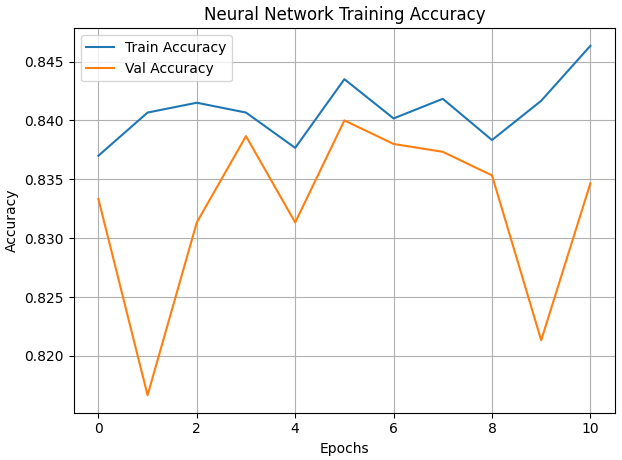

# 🚗 Car Insurance Claim Prediction

This repository contains a complete end-to-end machine learning pipeline for predicting car insurance claims using a real-world dataset. The project includes data cleaning, feature engineering, model evaluation, and interpretability techniques.

---

## 📊 Sample Visualizations

### 1. Exploratory: Claim Rate by Age Group

### 2. Exploratory: Claim Rate by Driving Experience

### 3. PCA Visualization (3D)

### 4. SHAP Summary Plot

### 5. Neural Network Training History

---

## 📂 Project Structure

- `Car_Insurance_Claim.csv` – The dataset
- `Car_Insurance_DeepLearning_Colab.ipynb` – Main notebook with full modeling workflow
- `images/` – Contains all reporting-quality visualizations
- `models/` – Placeholder for saved models (optional)

---

## 🧠 Models Used

- **Random Forest Classifier** (with permutation importance & feature selection)
- **KMeans clustering** (used as engineered feature)
- **PCA** (for 3D interactive visualization)
- **Neural Network (Keras)** with:
  - 1 hidden layer
  - Dropout regularization
  - Early stopping
  - Hyperparameter tuning using Keras Tuner

---

## 🧪 Evaluation

- Accuracy, precision, recall, F1-score
- Confusion matrix
- SHAP (TreeExplainer)
- Classification report

---

## 🛠️ Tools & Libraries

- `scikit-learn`, `pandas`, `matplotlib`, `plotly`
- `tensorflow`, `keras`, `keras-tuner`
- `shap`, `seaborn`

---

## 🧾 How to Run

1. Upload `Car_Insurance_Claim.csv` to Colab
2. Open `Car_Insurance_DeepLearning_Colab.ipynb`
3. Run all cells to execute data prep, modeling, and visualization
4. View generated plots in the `images/` directory

---

## 🚀 Future Improvements

- Add deployment-ready Flask API or Streamlit dashboard
- Integrate SHAP-based dashboards
- Export model using `joblib` or `tf.keras.models.save`

---

## 👤 Author

**Salah Aburajab**  
_Machine Learning & Data Science_

> This project was developed as a complete ML pipeline to demonstrate modeling, tuning, and interpretability skills.
